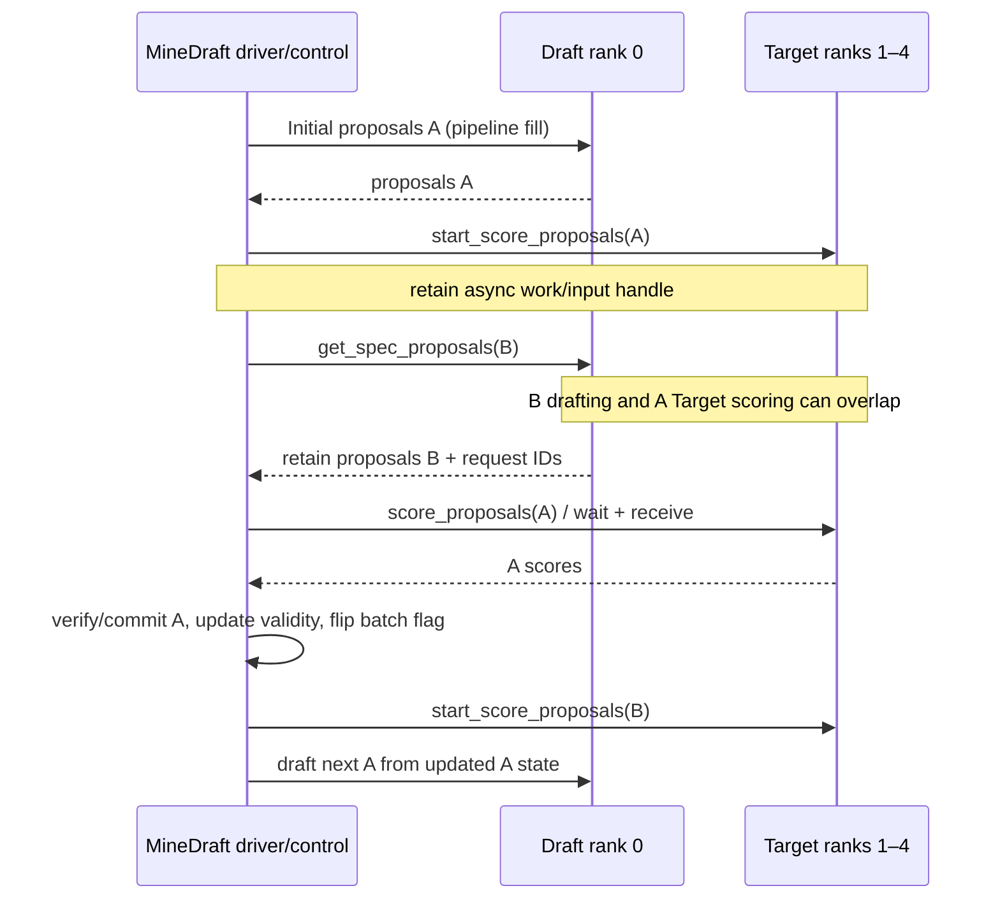

# Phase 4B.3 — MineDraft source audit

Status: source audit and proposed reuse boundary, 2026-09-06. No backend has been implemented or executed for this audit.

## Source basis

| Repository | Audited revision | Role |
| --- | --- | --- |
| SpecRhythm | `64031110e630b6643cc610620f05f8630e896c7c` | Current contracts; parent `8997ec9d0053d8a6b40b99b8b9694099a7607f1d` |
| electron-shaders/MineDraft | `272c8556797495fe9c9f6a3008337bcd5cc2d031` | Actual plugin source, also remote `main` when checked |
| vLLM 0.9.2 | `a5dd03c1ebc5e4f56f3c9d3dc0436e9c582c978f` | Definitions imported by MineDraft rather than vendored there |
| vLLM 0.25.1 | `752a3a504485790a2e8491cacbb35c137339ad34` | SpecRhythm migration destination; audited separately |

The local MineDraft checkout was clean. The 0.9.2 source archive and a Git archive of the pinned 0.25.1 commit were inspected as text, without installing or importing either runtime. Source paths, hashes and AST symbol locations are in [source-provenance.json](source-provenance.json). The local `tmp/repos/vllm-main` checkout has a different HEAD; its working tree was **not** used as the 0.25.1 baseline.

## 1. What actually owns the Draft model

MineDraft's ordinary Qwen Draft is a **proposer Worker/ModelRunner inside the speculative worker arrangement of one V0 engine/executor topology**. It is not a second `LLMEngine` or `AsyncLLMEngine` with an independent request scheduler.

The source construction path is:

1. [`SpecDecodeWorkerModulePatch.create_spec_worker`, lines 57–121][m-worker], obtains speculative configuration, constructs the Target scorer worker using `TargetModelRunner`, and derives the Draft configuration from the enclosing vLLM configuration. Pipeline parallelism greater than one is rejected here.
2. `SpecDecodeWorkerPatch.create_worker`, lines 130–280, chooses the ordinary causal-LM path. For Draft TP1 on CUDA, its runner class is upstream `TP1DraftModelRunner`; the proposer worker is upstream `MultiStepWorker`.
3. That worker is wrapped by upstream [`SmallerTpProposerWorker.maybe_wrap_worker`][v09-smaller]. Only participating Draft ranks own a functional proposer worker; other ranks receive a dummy wrapper.
4. With parallel mode enabled the enclosing object is `ParallelSpecDecodeWorker`; otherwise it is the patched `SpecDecodeWorker`. Alternative MLP/Medusa/EAGLE branches are distinct from this Qwen3-0.6B path.
5. `ParallelSpecDecodeWorker.init_device`, lines 769–827, initializes the two roles and scorer adapter. In the ordinary Qwen path, the driver loads the Draft and the non-driver ranks load Target shards. Merely having a scorer-worker Python object on the driver does not mean a second Target model is loaded there.

MineDraft reaches this arrangement through a broad plugin patch set, registered in [`minedraft/plugin/plugin.py`][m-plugin]. Its V0 scheduler, sequence metadata, workers, distributed helpers, runners and speculative helpers form a coordinated implementation. Importing only the class named `MultiStepWorker` would not reproduce that system on modern vLLM.

## 2. Exact Draft batching path

For the ordinary autoregressive proposer:

```text
ParallelSpecDecodeWorker._run_speculative_decoding_step(execute_model_req)
  → choose the sending/other cohort's seq_group_metadata_list
  → proposer_worker.get_spec_proposals(execute_model_req, bonus_seq_ids)
  → SmallerTpProposerWorker delegates on Draft rank 0
  → MultiStepWorker.get_spec_proposals
  → Top1Proposer.get_spec_proposals  [MineDraft override]
      split rows with proposal length 0 versus k; retain original row indices
      construct MineExecuteModelRequest(nonzero rows, is_proposing=True)
  → MultiStepWorker.sampler_output(..., sample_len=k)
      optional bonus-row expansion
  → Worker.execute_model(expanded_request with num_steps=k)
  → TP1DraftModelRunner.execute_model
      for step in range(k):
          model_executable(all active/expanded rows for this step)
          compute_logits + sample
          advance input IDs, positions and attention metadata
  → filter auxiliary rows; merge outputs into original request order
  → SpeculativeProposals(tokens[B,k], probabilities[B,k,V], lengths[B], ...)
```

Sources: [MineDraft Top1 override, lines 14–80][m-top1]; [upstream multi-step worker, lines 65–126 and 243–252][v09-multi]; [TP1 runner, lines 166–347][v09-tp1]. These are model batches, not a list of B independent model calls. At a decode step the model consumes rows for multiple requests in the same forward. Auxiliary bonus rows can make the physical model row count larger than the logical proposal-request count.

The optimized multi-step branch has conditions: the [runner's `supports_gpu_multi_step`, lines 134–159][v09-tp1], requires the supported decode attention path and excludes prompt/LoRA/prompt-adapter cases. The fallback in `MultiStepWorker.sampler_output` loops over speculative steps at Worker level, advancing metadata on CPU; it still executes a request batch at each step. It is not necessarily the optimized all-GPU metadata-advance path.

### Row eligibility and EOS

The inherited [`Top1Proposer._split_by_proposal_len`][v09-top1] produces the nonzero subset: prefill/non-speculative rows and rows that cannot fit the lookahead do not become ordinary k-token proposals. The merge preserves their positions with no-proposal lengths and sentinel token entries. Empty/non-proposal work must not be counted as a successful B-row draft step.

Do **not** import a stronger EOS claim from this batching mechanism. The TP1 runner's fixed-k loop does not implement SpecRhythm's per-request stop-at-first-EOS proposal loop. In V0, [`MultiStepOutputProcessor._process_seq_outputs`, lines 168–205][v09-output], trims verified output to the output limit and, with the applicable tokenizer/detokenizer and EOS policy, to the first EOS; its comment explicitly acknowledges tokens can have been generated beyond EOS within the block. Finished sequences are subsequently removed by the engine/scheduler. Therefore MineDraft's execution shape is useful, while SpecRhythm's existing EOS canonicalization and no-post-EOS-round rules must remain authoritative.

### Forward-count interpretation

For a supported nonempty homogeneous decode cohort and k proposals, the native TP1 loop performs **k batched model forwards**, excluding setup/prefill and special fallback work. One Worker call can contain those k model calls. This is not B×k model launches. Bonus materialization can add auxiliary rows rather than another independent request loop.

This count is not directly comparable to the current HF `propose()` counter: HF has cached next logits, samples the first proposal without a new forward, and performs p−1 proposal forwards for p actual tokens. Its initial materialization and post-verification KV updates are counted elsewhere. The proposed backend must report those categories separately; see [the design](phase4b3-batched-draft-design.md).

## 3. Paged KV ownership and persistence

The proposer uses vLLM's worker-owned paged KV, not per-request HF `past_key_values` tensors. Upstream [`Worker.initialize_cache` and `_init_cache_engine`][v09-worker] allocate [`CacheEngine`][v09-cache] storage. The V0 scheduler/block manager owns the sequence-to-block-table mapping and lookahead reservation; the execution request carries sequence-group metadata and block tables into the worker. Draft and Target have distinct physical KV allocations even when their metadata uses the same sequence/block indices.

MineDraft [`ParallelSpecDecodeWorker.determine_num_available_blocks` and `initialize_cache`, lines 842–866][m-worker], profile the appropriate worker on each role, initialize proposer caches through the wrapper, and initialize Target caches only on non-driver ranks. Cache setup temporarily adjusts the scorer TP configuration. The driver profiling exception fallback returns an enormous synthetic capacity; that fallback is an implementation detail to **reject for SpecRhythm**, which requires real allocation evidence and fail-closed initialization.

[`MultiStepWorker._shallow_copy_seq_group_metadata`, lines 291 onward][v09-multi], makes temporary sequence metadata for speculative advancement. The block tables point at persistent allocated pages, but speculative token mutations do not become the scheduler's authoritative committed sequence merely because the Draft wrote KV. [`_assert_enough_kv_space`, lines 357–389][v09-multi], reserves enough room for `current_sequence_length + k - 1`: the final sampled token normally has not yet been forwarded.

### Native V0 rollback and catch-up

There is no HF-style tensor crop in this path. Logical sequence length/computed-token metadata determines which KV positions are valid. Rejection makes the next decode attend to the accepted prefix; subsequent forwards overwrite stale rejected positions. The upstream [V0 model runner's decode input preparation, around lines 544–574][v09-runner], sets decode context from `seq_len - 1` and feeds the authoritative final token at its position. Allocated tail capacity can remain resident without becoming valid context.

| Verification outcome | Native proposer action on following work | Source mechanism |
| --- | --- | --- |
| First token rejected | Use the original prefix followed by the Target correction; overwrite the first speculative position | Committed sequence metadata plus decode `context_len = seq_len - 1` |
| Partial acceptance | Keep KV corresponding to accepted proposal tokens; ignore rejected suffix; feed the correction at the shortened position | Temporary speculative metadata, authoritative next-round sequence length |
| Target correction | Correction is the final token of the new sequence and becomes the next model input | Same decode-input preparation |
| All proposals accepted | The last proposed token may still lack KV | One-token-lag invariant in the multi-step worker |
| Full acceptance plus bonus | Catch up the last proposal token and the bonus through expanded sequence metadata | `_expand_execute_model_request`, `_copy_seq_metadata_excluding_last_token`, TP1 bonus-row advance |
| EOS/output limit/termination | Verified output is truncated under output policy; finished request bookkeeping removes bonus tracking and ultimately frees the block table | Multi-step output processor, speculative finished tracking, block manager `free` |

The important full-accept case is explicit in [`MultiStepWorker._expand_execute_model_request`, lines 141–201][v09-multi]. Requests identified as having a previous bonus are expanded with an auxiliary row excluding the last token, alongside the original row. They retain their sequence/block-table relation. [`TP1DraftModelRunner`, lines 327–347][v09-tp1], handles that auxiliary row during GPU advancement, and worker filtering removes its output from the logical proposal batch. [`SpecDecodeWorker._track_sequences_with_bonus_tokens`, lines 1237–1247][v09-spec], records which sequences need this handling; finished-request tracking clears it. The [V0 block manager][v09-block] manages append capacity and request freeing.

These mechanisms establish the reusable principle: **separate allocated capacity, materialized KV and authoritative tokens**. They are not a callable external rollback API that can be transplanted into SpecRhythm 0.25.1.

## 4. Five-rank Qwen topology

The [parallel experiment script][m-script] uses `CUDA_VISIBLE_DEVICES=4,0,1,2,3`, `--tensor-parallel-size 5`, a Qwen3-32B Target, and Draft TP1 (including the Qwen3-0.6B option). Its effective Target TP is four, although the enclosing parallel configuration uses five ranks.

| Role | Global rank(s) | Logical visible device(s) | Physical GPU(s) in that script | Group |
| --- | --- | --- | --- | --- |
| Driver + real Draft worker | 0 | 0 | 4 | Draft subgroup `[0]` |
| Target shards | 1,2,3,4 | 1,2,3,4 | 0,1,2,3 | non-driver TP `[1,2,3,4]` |
| Request/control and score exchange | 0,1,2,3,4 | all | all | enclosing TP/world group |

[`initialize_model_parallel`, around lines 289–350][m-dist], creates the ordinary group and the non-driver group. On the driver, the non-driver coordinator has placeholder non-participant rank metadata. [`get_tensor_model_parallel_world_size/rank`, lines 474–481][m-dist], route Target model partitioning queries to that non-driver group. [`communication_op.py`][m-comm] routes Target model all-reduce/all-gather/reduce-scatter/gather there, while control tensor-dictionary broadcasts still use the enclosing group. Configuration checks temporarily use Target TP−1 in [`config.py`][m-config].

For Draft, upstream `SmallerTpProposerWorker` supplies the rank-0 subgroup. MineDraft's [`patch_tensor_parallel_group`, lines 446–470][m-dist], temporarily replaces **both** ordinary and non-driver TP group references with that subgroup, restoring both afterward. Dummy proposer ranks do not load Draft weights or allocate real Draft KV. A representative Target non-driver rank returns score tensors through the enclosing communication path.

Thus different TP sizes work because MineDraft explicitly rewrites group/configuration semantics throughout its V0 topology. This is not a general guarantee that modern vLLM's built-in Draft model supports a separate GPU or unequal TP sizes. SpecRhythm should retain its independent Draft world of size one and Target world of size two.

## 5. Parallel control plane, separately from batching

The alternating mechanism is in [`ParallelSpecDecodeWorker._run_speculative_decoding_step`, lines 1225–1517][m-worker]. The scheduler assigns/recycles `batch_flag`; `_split_batched_requests` separates the sending cohort from the other cohort. First use must obtain a proposal before it can score that cohort. Thereafter `_previous_proposals`, `_previous_request_ids`, and validity masks carry the other cohort's proposals into its next scoring turn. `_prepare_previous_proposals`, lines 1061–1149, remaps by request IDs and handles changed membership/prefill. A flag flip does not itself establish identity correctness.



The launch/wait split is concrete:

* [`ParallelBatchExpansionTop1Scorer.start_score_proposals`, lines 13–39][m-batch], expands the verification batch and calls the scorer worker; `score_proposals`, lines 42–65 onward, waits on the saved work and contracts returned results. The [parallel MQA scorer, lines 177–243][m-mqa], has the corresponding two-stage interface with a different verification layout.
* [`WorkerBase` patches][m-workerbase] broadcast Target execution input asynchronously on the driver and return with no local Target forward; the other ranks execute their Target shards.
* [`Works.wait`, lines 43–58][m-dist], waits for its distributed Work objects. `broadcast_tensor_dict`, lines 167–253, uses asynchronous tensor broadcasts and retains results/handles. The object/metadata broadcast is still blocking: this is not a claim of a zero-cost, fully asynchronous launch.
* Input tensors and score buffers must remain owned until their work/receive completes. The driver stores next-cohort proposal tensors, rather than treating them as already committed tokens. Finished/preempted request tracking invalidates corresponding previous proposals.

Batch flags, previous-proposal reuse, group communication and verification ordering are MineDraft's **control plane**. A vLLM worker's batched autoregressive execution and paged KV are its **data plane**. SpecRhythm can adopt the latter without replacing its Dual ready/claim/retire protocol.

## 6. Reuse classification

Classification applies to this migration, not to the general quality of the component.

| Component | Classification | Reason and SpecRhythm boundary |
| --- | --- | --- |
| `MultiStepWorker` | PORTABLE WITH API ADAPTATION | Batch all eligible requests at each step; replace removed V0 request/worker APIs with pinned V1 input preparation |
| `TP1DraftModelRunner` | PORTABLE WITH API ADAPTATION | GPU input/position/slot progression is valuable; its V0 class and FLASH_ATTN assumptions cannot be imported into 0.25.1 |
| `SmallerTpProposerWorker` | ARCHITECTURAL REFERENCE ONLY | Explains unequal TP inside one world; unnecessary in independent Draft world=1 |
| Proposer paged KV management | DIRECTLY REUSABLE CONCEPT | Resident private pages, logical frontier rollback, overwrite rejected tail; implement with current KV manager, not old block-manager objects |
| `get_spec_proposals` | PORTABLE WITH API ADAPTATION | Batch input/output plus explicit row map; preserve SpecRhythm proposal IDs/hash/budget instead of adopting V0 tensors as the public contract |
| `SpecDecodeWorker` | ARCHITECTURAL REFERENCE ONLY | Bundles proposer/scorer/rejection ownership already held elsewhere in SpecRhythm |
| `ParallelSpecDecodeWorker` | ARCHITECTURAL REFERENCE ONLY | Useful launch/draft/wait timeline; would duplicate the proven Dual state machine |
| Target async scorer | ARCHITECTURAL REFERENCE ONLY | Demonstrates work lifetime; Target five-patch pipeline and overlap evidence remain unchanged |
| Two-batch scheduler | SHOULD NOT BE COPIED | Would change cohort selection, admission and scheduling during a backend experiment |
| Custom distributed groups | SHOULD NOT BE COPIED | Broad V0 global rewrites; separate services already give required device isolation/concurrency |
| Tetris | SHOULD NOT BE COPIED | `_postprocess` and `tetris.py` select/reshape proposals and verification capacity; changes budget/selection independently of batching |
| PEARL | SHOULD NOT BE COPIED | Additional speculative continuation/previous-proposal machinery and lookahead reservation change control/KV assumptions |
| Batch splitting / flag logic | SHOULD NOT BE COPIED | SpecRhythm owns cohort/ready selection; backend receives the ordered eligible work it is given |

Tetris is visible in [`SpecDecodeWorkerPatch._postprocess`][m-worker] and [`tetris.py`][m-tetris]; PEARL branches include `_update_execute_model_req`, previous-proposal handling, and [scheduler lookahead extension][m-sched]. Neither is needed to make one Draft model forward process B requests.

## 7. Architecture/research boundary

The source supports attributing batched vLLM drafting, a two-cohort parallel speculative pipeline, this particular launch/draft/wait implementation, and optional Tetris/PEARL mechanisms to the reference system. Reusing a high-performance Draft data plane is an engineering dependency, not evidence that batched drafting itself is new.

SpecRhythm retains its own resident request lifecycle, decoupled placement, DecodeReady/admissibility, stable-ID evidence, and scheduler decisions. Future rhythm-aware policies or shaping/selection must be evaluated as separate changes if retained. This audit establishes an implementation boundary; it does not establish priority or novelty against the broader literature. Any later source reuse must preserve applicable MIT/Apache notices and attribution.

[m-worker]: https://github.com/electron-shaders/MineDraft/blob/272c8556797495fe9c9f6a3008337bcd5cc2d031/minedraft/plugin/spec_decode/spec_decode_worker.py#L57
[m-plugin]: https://github.com/electron-shaders/MineDraft/blob/272c8556797495fe9c9f6a3008337bcd5cc2d031/minedraft/plugin/plugin.py
[m-top1]: https://github.com/electron-shaders/MineDraft/blob/272c8556797495fe9c9f6a3008337bcd5cc2d031/minedraft/plugin/spec_decode/top1_proposer.py#L14
[m-script]: https://github.com/electron-shaders/MineDraft/blob/272c8556797495fe9c9f6a3008337bcd5cc2d031/scripts/experiment_1_parallel.sh
[m-dist]: https://github.com/electron-shaders/MineDraft/blob/272c8556797495fe9c9f6a3008337bcd5cc2d031/minedraft/plugin/distributed/parallel_state.py
[m-comm]: https://github.com/electron-shaders/MineDraft/blob/272c8556797495fe9c9f6a3008337bcd5cc2d031/minedraft/plugin/distributed/communication_op.py
[m-config]: https://github.com/electron-shaders/MineDraft/blob/272c8556797495fe9c9f6a3008337bcd5cc2d031/minedraft/plugin/config.py
[m-batch]: https://github.com/electron-shaders/MineDraft/blob/272c8556797495fe9c9f6a3008337bcd5cc2d031/minedraft/plugin/spec_decode/batch_expansion.py#L13
[m-mqa]: https://github.com/electron-shaders/MineDraft/blob/272c8556797495fe9c9f6a3008337bcd5cc2d031/minedraft/plugin/spec_decode/mqa_scorer.py#L177
[m-workerbase]: https://github.com/electron-shaders/MineDraft/blob/272c8556797495fe9c9f6a3008337bcd5cc2d031/minedraft/plugin/worker/worker_base.py
[m-sched]: https://github.com/electron-shaders/MineDraft/blob/272c8556797495fe9c9f6a3008337bcd5cc2d031/minedraft/plugin/core/scheduler.py
[m-tetris]: https://github.com/electron-shaders/MineDraft/blob/272c8556797495fe9c9f6a3008337bcd5cc2d031/minedraft/plugin/spec_decode/tetris.py
[v09-multi]: https://github.com/vllm-project/vllm/blob/a5dd03c1ebc5e4f56f3c9d3dc0436e9c582c978f/vllm/spec_decode/multi_step_worker.py
[v09-tp1]: https://github.com/vllm-project/vllm/blob/a5dd03c1ebc5e4f56f3c9d3dc0436e9c582c978f/vllm/spec_decode/draft_model_runner.py
[v09-top1]: https://github.com/vllm-project/vllm/blob/a5dd03c1ebc5e4f56f3c9d3dc0436e9c582c978f/vllm/spec_decode/top1_proposer.py
[v09-smaller]: https://github.com/vllm-project/vllm/blob/a5dd03c1ebc5e4f56f3c9d3dc0436e9c582c978f/vllm/spec_decode/smaller_tp_proposer_worker.py
[v09-worker]: https://github.com/vllm-project/vllm/blob/a5dd03c1ebc5e4f56f3c9d3dc0436e9c582c978f/vllm/worker/worker.py#L312
[v09-cache]: https://github.com/vllm-project/vllm/blob/a5dd03c1ebc5e4f56f3c9d3dc0436e9c582c978f/vllm/worker/cache_engine.py
[v09-runner]: https://github.com/vllm-project/vllm/blob/a5dd03c1ebc5e4f56f3c9d3dc0436e9c582c978f/vllm/worker/model_runner.py#L544
[v09-spec]: https://github.com/vllm-project/vllm/blob/a5dd03c1ebc5e4f56f3c9d3dc0436e9c582c978f/vllm/spec_decode/spec_decode_worker.py#L1224
[v09-block]: https://github.com/vllm-project/vllm/blob/a5dd03c1ebc5e4f56f3c9d3dc0436e9c582c978f/vllm/core/block_manager.py
[v09-output]: https://github.com/vllm-project/vllm/blob/a5dd03c1ebc5e4f56f3c9d3dc0436e9c582c978f/vllm/engine/output_processor/multi_step.py#L168
